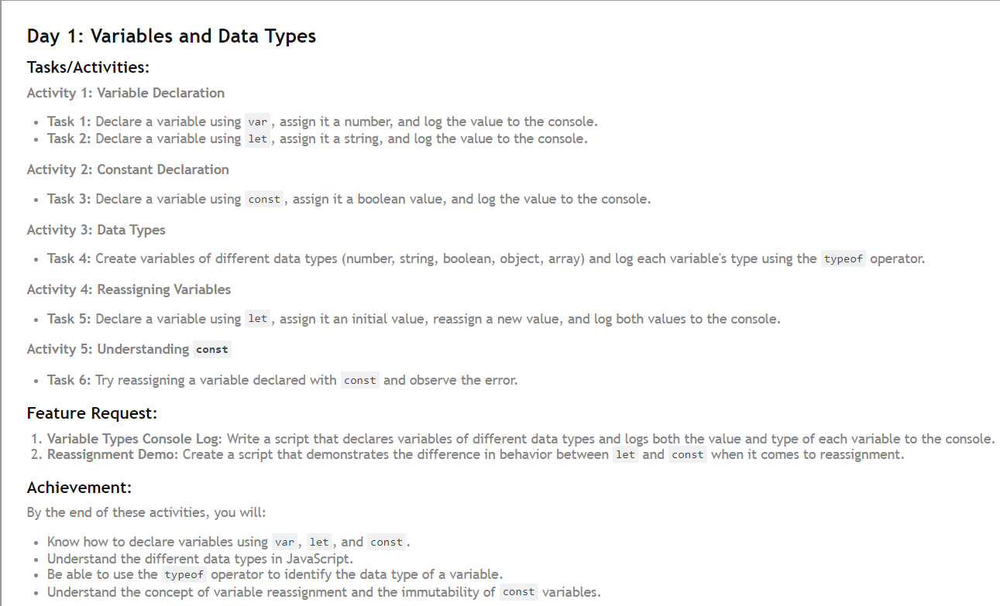
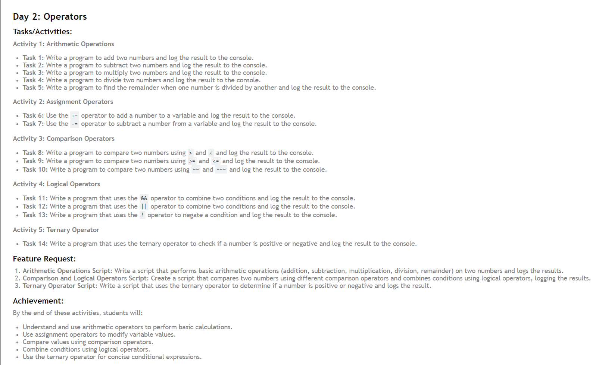
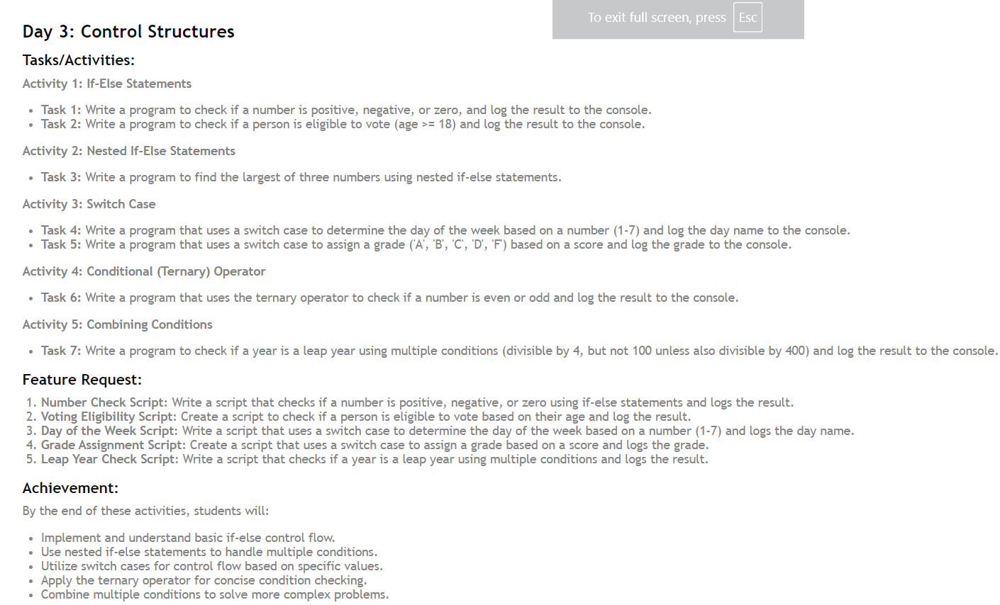

# 30 Days of JavaScript Challenge

In this challenge, different JavaScript topics and problems will be solved each day for 30 days. Each day, I understand a new concept, ranging from basic to advanced, and see my progress here :-

## Topics Covered

# DAY-1

1. **Day 1: Variables and Data Types** - Understanding `var`, `let`, `const`, and various data types in JavaScript.

# DAY-2

2. **Day 2: Operators** - Understanding `arithmetic operator`, `assignment operator`, `logical operator`, `comparison operator` & `ternary operator` in JavaScript.

# DAY-3

2. **Day 2: Control Structures** - Understanding `if else statement`, `nested if else statement`, `switch case`, `ternary operator` & `combining statement` in JavaScript.

