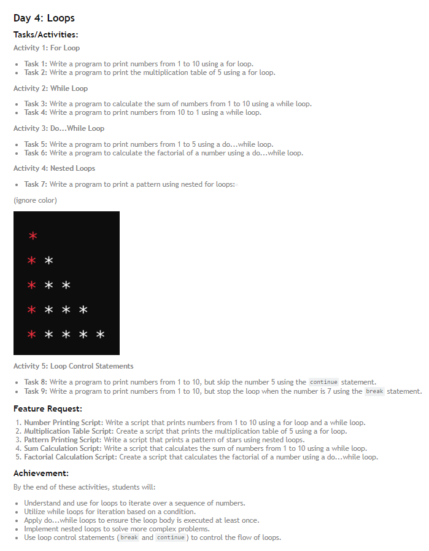
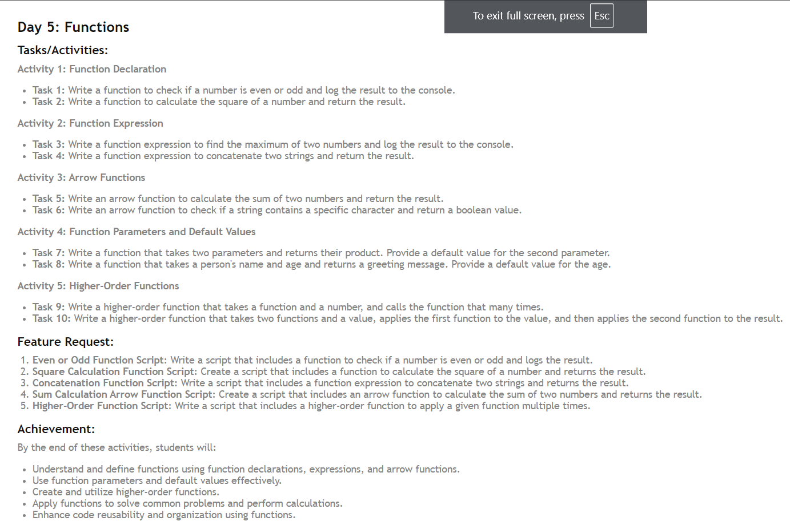
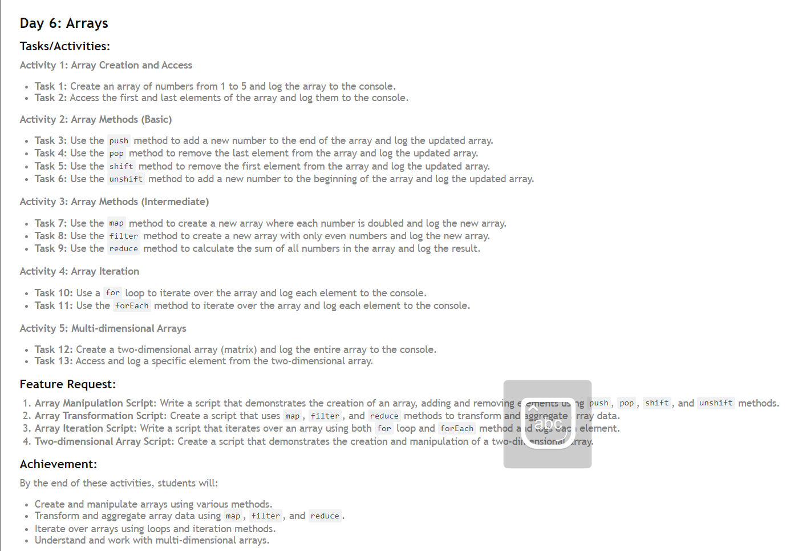
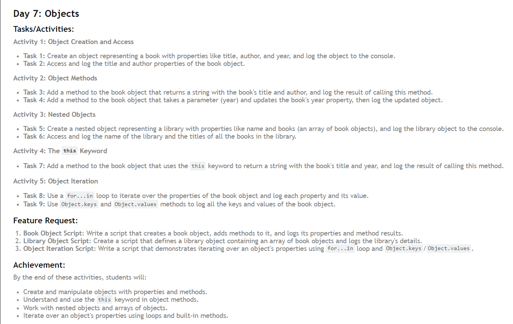

# 30 Days of JavaScript Challenge

In this challenge, different JavaScript topics and problems will be solved each day for 30 days. Each day, I understand a new concept, ranging from basic to advanced, and see my progress here :-

## Topics Covered

# DAY-1

1. **Day 1: Variables and Data Types** - Understanding `var`, `let`, `const`, and various data types in JavaScript.

# DAY-2

2. **Day 2: Operators** - Understanding `arithmetic operator`, `assignment operator`, `logical operator`, `comparison operator` & `ternary operator` in JavaScript.

# DAY-3

3. **Day 3: Control Structures** - Understanding `if else statement`, `nested if else statement`, `switch case`, `ternary operator` & `combining statement` in JavaScript.

# DAY-4

4. **Day 4: Loops** - Understanding `for loop`, `while loop`, `do... while loop`, `nested loops` , `break ( loop control statement)` & `continue ( loop control statement)` in JavaScript.

# DAY-5

5. **Day 5: Function ** - Understanding `function declaration `, `function expresion `, `arrow function `, `function parameter and default value ` & `higher order function` in JavaScript.

# DAY-6

6. **Day 6: Array ** - Understanding `array creation & access `, `array method (basic and intermediate) `, `array iteration  ` & `multi dimensional array` in JavaScript.

# DAY-7

7. **Day 7: Objects ** - Understanding `Object creation & access `, `object method `, `nested object  ` & `This keyword` in JavaScript.

